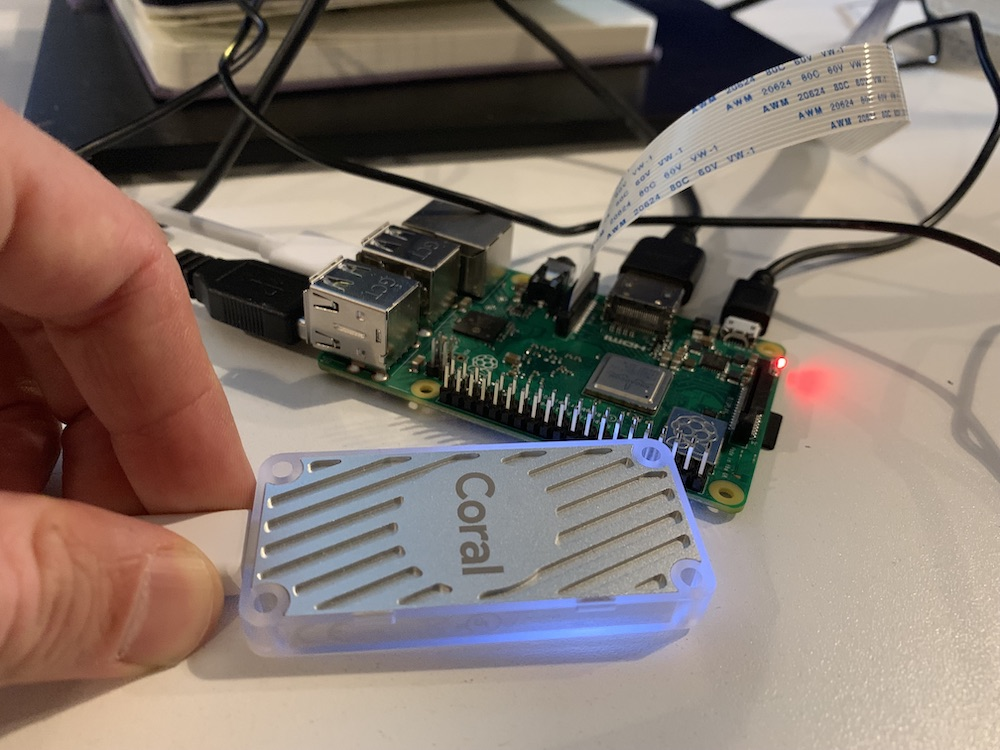

# Coral Edge TPU on the Raspberry Pi Object Detection in Processing Demo

This shows how to use the [Coral Edge TPU Accelerator](https://coral.withgoogle.com/) on the Raspberry Pi to do real-time object detection 
with a camera, and draw the results in Processing.  It works by capturing frames in [Processing,](https://processing.org/)
streaming them over udp to a python script, which sends the frames to the Coral Edge TPU to estimate
detections.  The results are sent back from python over TCP to processing.

In Processing, both sending of the data over UDP and receiving the results back over TCP are done in separate threads.
This approach has the advantage of allowing the drawing loop to not be blocked while sending frames or parsing results, enabling
maximum frame rate when drawing.

Huge thanks to goes to Dan Shiffman for his  [Processing-UDP-Video-Streaming example](https://github.com/shiffman/Processing-UDP-Video-Streaming), as well as Maksin Surguy's [Processing with the Pi Camera tutorial](https://pi.processing.org/tutorial/camera/).  These laid the foundation for how to do both udp streaming and camera capture with the raspberry pi.

## Requirements:

* Raspberry Pi 3b or 3b+ with Raspberrian
* Google Coral Edge TPU Accelerator
* Any Raspberry Pi camera that connects to the Camera port.

*The Coral Edge TPU Acccelerator and Raspberry Pi 3b+*

## Setup 

Install Processing on the Raspberry Pi:

    curl https://processing.org/download/install-arm.sh | sudo sh

**Follow the instructions to enable the Pi Camera in Processing:**
https://pi.processing.org/tutorial/camera/#gl-video-library-installation-and-set-up

If you haven't already, **follow the instructions to Setup the Edge TPU runtime and Python Library:**
https://coral.withgoogle.com/tutorials/accelerator/, in particular the steps:

    wget https://dl.google.com/coral/edgetpu_api/edgetpu_api_latest.tar.gz -O edgetpu_api.tar.gz --trust-server-names

    tar xzf edgetpu_api.tar.gz

    cd edgetpu_api

    bash ./install.sh

**This repository should be checked out in a folder adjacent to 'edgetpu_api'.**

## Usage

**All of the below code should be run from within the root directory of this repo**

To run everything in python, including camera capture and drawing the results:

    python3 object_detection_camera.py --model ./test_data/mobilenet_ssd_v2_coco_quant_postprocess_edgetpu.tflite --label ./test_data/coco_labels.txt

For convenience sake, the above can be run with `./coco_detect.sh`

To run camera capture and drawing of the results in processing, first startup the python script that will perform the object detection on the Coral Edge Tpu:
    `./socket_coco_detect.sh`

Then in processing, open and run the sketch  `processingClient/processingClient.pde`